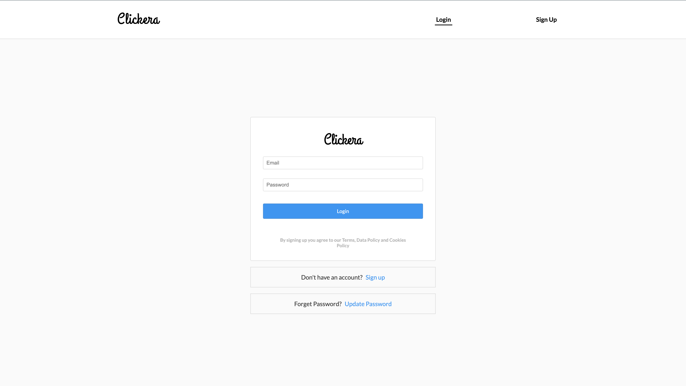

<h2> Clickera </h2>

### Social Media App - A replica of Instagram

<a href="https://clickera.herokuapp.com/" target="_blank">Live demo</a>

### Features

- User Authentication
- Publising photos and posts, user can comment and like/dislike the post.
- User can follow/unfollow other users.
- Reset password through E-mail.
- Deletion of post and comments by the owner.

### Technologies

- [React](https://reactjs.org/) with hooks
- [Node.js](https://nodejs.org/en/)
- [Express](https://expressjs.com/)
- [MongoDB](https://www.mongodb.com/) (Database)

------------
